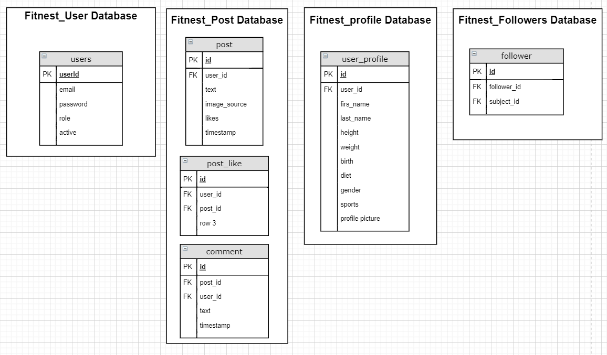
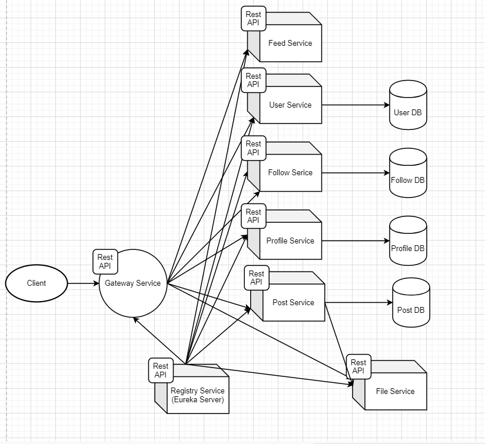
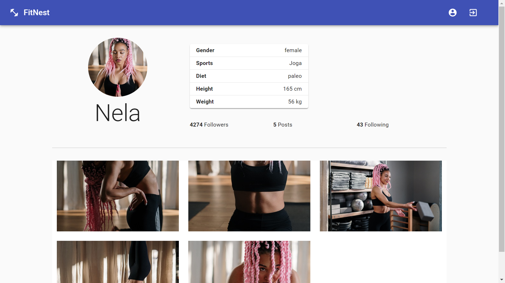
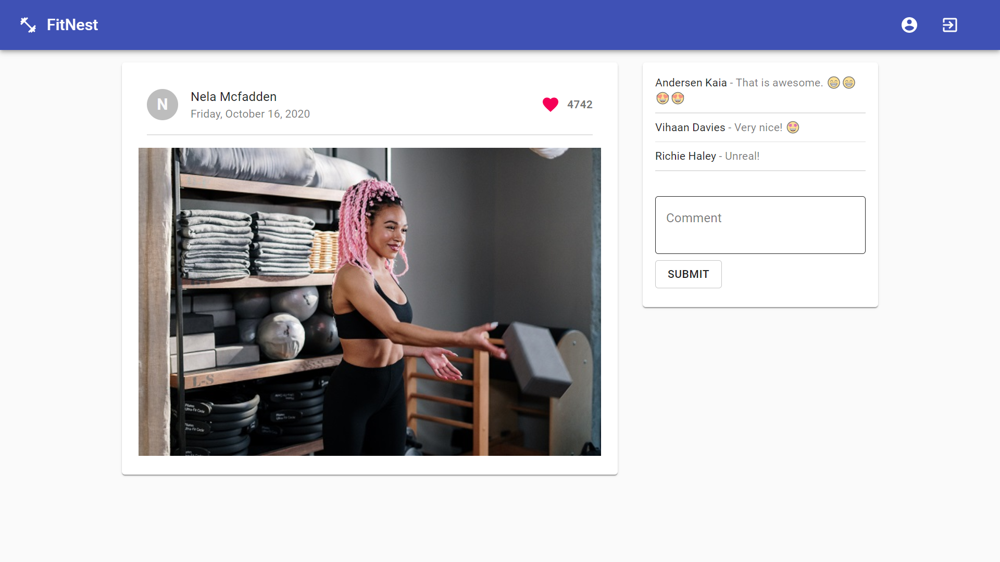
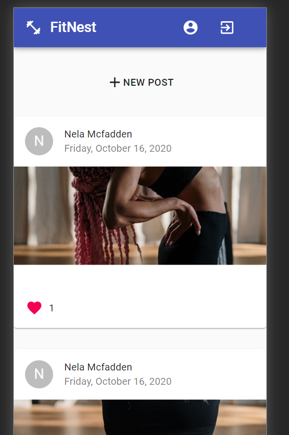

# FitNest

This is a social media page for athletes with Spring Boot microservices backend and React frontend.  
The user can edit their profile, upload a profile picture, share posts, follow other users, view their posts and react to them with likes and comments.
I used a MySQL database to store the data, and I used the Spring Data JPA Repository to manage the database.
Each service has its own database. The services have a REST API. 

The API gateway filters the requests, and it forwards the authentication token to services. 
The services can identify the user based on the auth token (of course, only if the auth token is valid). 
The services communicate with each other via HTTP requests. I used RestTemplate to make HTTP requests.

The backend consists of 8 services:

  - The User service handles authentication with JSON Web Token. The password is hashed with BCrypt.
  - The Profile Service is responsible for editing users' profiles and profile pictures.
  - Feed Service manages users' feeds (pagination based on post id and the number of items).
  - The Follow Service is responsible for user follows and tracking follow numbers.
  - The Post Service is responsible for CRUD operations on users' posts.
  - The File Service is responsible for storing and accessing images.
  - I used the Eureka registration server to facilitate communication between services.
  - I used Spring Cloud Gateway for a common entry point and a common authentication point.

The frontend is a React application with Material-UI components. API calls are helped by Axios, and routing is handled by react-router. 

The state is being stored in easy-peasy, which is a state manager built on top of redux, made somewhat simpler.

